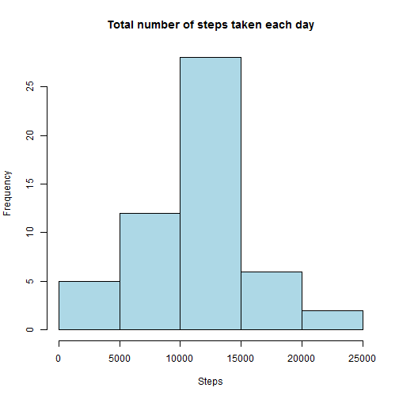
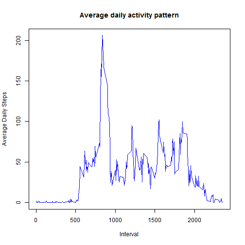
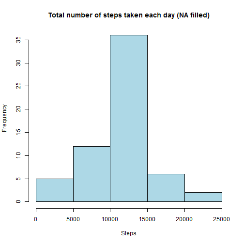
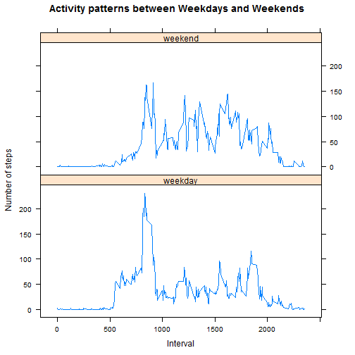

# Reproducible Research: Peer Assessment 1


## 1. Loading and preprocessing the data
 
a. Load the activity monitoring data

```r
unzip("activity.zip")

amd <- read.csv("activity.csv")
```


b. Process the data  for analysis

```r
## convert date variable as date type
amd$date <- as.Date(as.character(amd$date), format = "%Y-%m-%d")
```


## 2. What is mean total number of steps taken per day?

a. Histogram of the total number of steps taken each day

```r
daily.steps <- aggregate(steps ~ date, data = amd, sum)

hist(daily.steps$steps, main = "Total number of steps taken each day", xlab = "Steps", 
    col = "lightblue")
```

 


b. Mean and median total number of steps taken per day

Mean 

```r
mean(daily.steps$steps, na.rm = TRUE)
```

```
## [1] 10766
```


Median

```r
median(daily.steps$steps, na.rm = TRUE)
```

```
## [1] 10765
```


## 3. What is the average daily activity pattern?

a. Time series plot (i.e. type = "l") of the 5-minute interval (x-axis) and the average number of steps taken, averaged across all days (y-axis)


```r
interval.avg <- aggregate(steps ~ interval, data = amd, mean)

names(interval.avg)[2] <- "avg.steps"

plot(interval.avg, main = "Average daily activity pattern", type = "l", xlab = "Interval", 
    ylab = "Average Daily Steps", col = "blue")
```

 


b. Which 5-minute interval, on average across all the days in the dataset, contains the maximum number of steps?


```r
interval.avg$interval[which.max(interval.avg$avg.steps)]
```

```
## [1] 835
```


## 4. Imputing missing values

a. Total number of missing values in the dataset (i.e. the total number of rows with NAs).


```r
sum(is.na(amd))
```

```
## [1] 2304
```


b. Fill all the missing values in the dataset using the mean for the 5-minute interval calculated from Assignment Part 3a.


```r
## merge amd and interval.avg dataframes on interval
fill.na <- merge(amd, interval.avg, by = "interval", sort = FALSE)

## arrange according to date and interval
fill.na <- fill.na[with(fill.na, order(date, interval)), ]

## replace steps having NAs with the interval avg.steps
suppressWarnings(fill.na$steps <- replace(fill.na$steps, is.na(fill.na$steps), 
    fill.na$avg.steps))
```


c. Create a new dataset that is equal to the original dataset but with the missing data filled in.


```r
amd.new <- fill.na[, c(2, 3, 1)]
```


d. Histogram of the total number of steps taken each day and the mean and median total number of steps taken per day. 

```r
daily.steps2 <- aggregate(steps ~ date, data = amd.new, sum)

hist(daily.steps2$steps, main = "Total number of steps taken each day (NA filled)", 
    xlab = "Steps", col = "lightblue")
```

 


Mean 

```r
mean(daily.steps2$steps, na.rm = TRUE)
```

```
## [1] 10766
```


Median 

```r
median(daily.steps2$steps, na.rm = TRUE)
```

```
## [1] 10766
```


Do these values differ from the estimates from the first part of the assignment?

* The mean remains the same and median is a step higher than in Part 2b of the assignment.

What is the impact of imputing missing data on the estimates of the total daily number of steps?

* The median has shifted towards the mean.

## 5. Are there differences in activity patterns between weekdays and weekends?

a. Create a new factor variable in the dataset with two levels - "weekday" and "weekend" indicating whether a given date is a weekday or weekend day.

```r
amd.new$day.type <- factor(format(amd.new$date, "%A"))

levels(amd.new$day.type) <- list(weekday = c("Monday", "Tuesday", "Wednesday", 
    "Thursday", "Friday"), weekend = c("Saturday", "Sunday"))
```


b. Panel plot containing a time series plot (i.e. type = "l") of the 5-minute interval (x-axis) and the average number of steps taken, averaged across all weekday days or weekend days (y-axis).

```r
suppressWarnings(library(lattice))

new.avg.interval <- aggregate(amd.new$steps, by = list(amd.new$day.type, amd.new$interval), 
    mean, na.rm = TRUE, na.action = NULL)

names(new.avg.interval)[1] <- "day.type"

names(new.avg.interval)[2] <- "interval"

names(new.avg.interval)[3] <- "avg.steps"

xyplot(new.avg.interval$avg.steps ~ new.avg.interval$interval | new.avg.interval$day.type, 
    layout = c(1, 2), main = "Activity patterns between Weekdays and Weekends", 
    type = "l", xlab = "Interval", ylab = "Number of steps")
```

 

